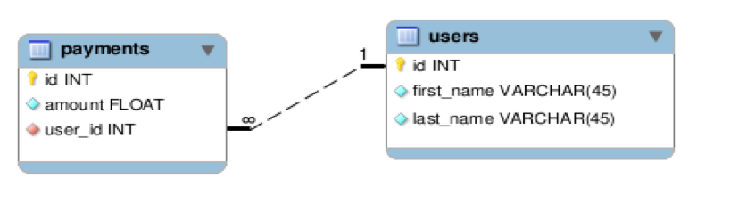
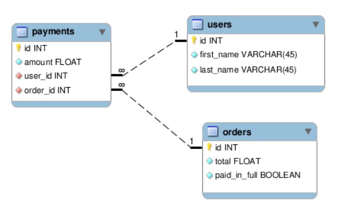
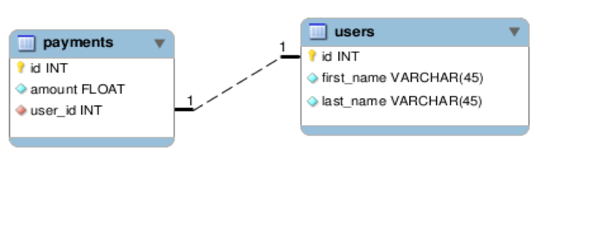
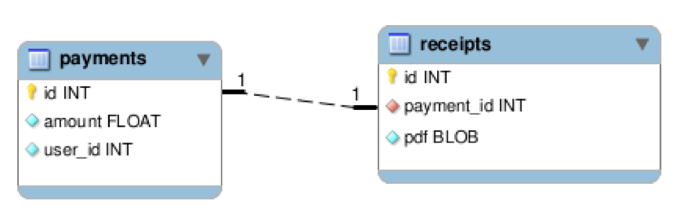
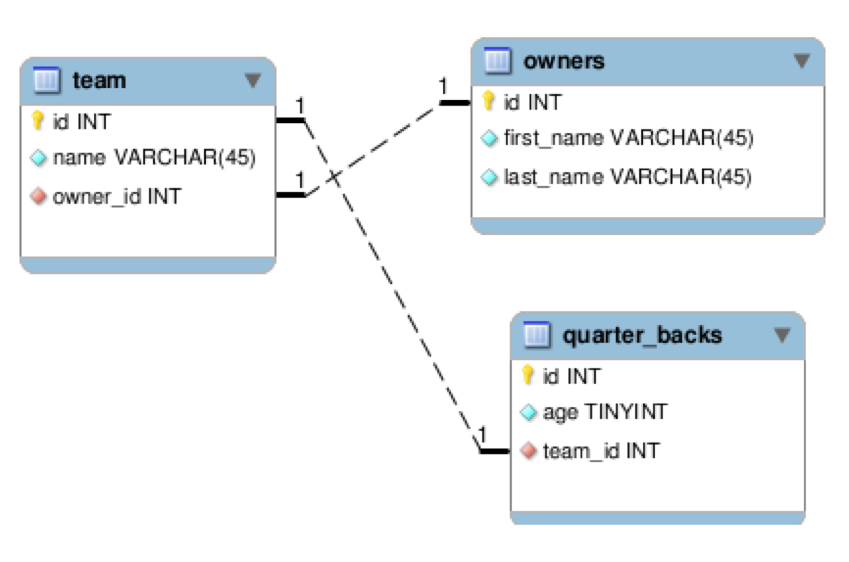
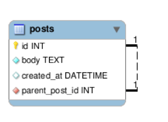

# 关联

什么是关联？通过声明你模块间的关联，你允许他们相互之间进行通信。这关联应该匹配你向管理的表之间的数据。

##  常规选项

这些是在各种关联中都有效的选项。

- Conditions:字符串/数组或者查询条件
- readonly:相关联的对象能否被保存/破坏
- select:在选择子句中选择列
- class_name:关联模型的类名
- foreign_key:外键名字

让我们在稍微不同的关联类型中看下这些选项。

### conditions

如下，我们指定payment与一个不应该是空白的order对象相关联。

```php
class Order extends ActiveRecord\Model {
  static $has_many = array(
    array('payments', 'conditions' => array('void = ?' => array(0)))
  );
}
```

### readonly

如果你给你的关联添加一个只读选项，那么关联的对象不能被保存，但是，几处对象还是能够被保存。

```php
class Payment extends ActiveRecord\Model {
  static $belongs_to = array(
    array('user', 'readonly' => true)
  );
}

$payment = Payment::first();
$payment->paid = 1;
$payment->save(); # this will save just fine

$payment->user->first_name = 'John';
$payment->user->save(); # this will throw a ReadOnlyException
```

### select

有时候你不需要你的某个关联中的所有的列（例:它可能是一个极其庞大的表）并且你能够指定你需要的特定的列。

```php
class Payment extends ActiveRecord\Model {
  static$belongs_to = array(
        array('person', 'select' => 'id,first_name, last_name')
  );
}
```

### class_name

在这个例子中账单与用户有一个一对一的关系，但是我们想使用这个关联通过”person”这个名字。因此，我们需要提供一个关联对象的类名。否则，ActiveRecord会尝试去查找一个”Person”类。

```php
class Payment extends ActiveRecord\Model {
  static $belongs_to = array(
    array('person', 'class_name' => 'User')
  );
}
```

## has_many

一个一对多的关系。当声明一个has_many关联时，你应该使用一个关联模型的复数的表，除非你想使用clas_name选项。

```php
# one-to-many association with the model "Payment" 
class User extends ActiveRecord\Model {
  static $has_many = array(
    array('payments')
  );
}

$user = User::first();
print_r($user->payments); # => will print an array of Payment objects

$payment = $user->create_payment(array('amount' => 1)); # build|create for associations.
```



选项（不属于常规选项）

- limit/offset:限制记录条数
- primary_key:关联的主键名（默认为”id”）
- group:GROUP BY子句
- order:ORDER BY子句
- through:用于”穿过”的关联

```php
class Order extends ActiveRecord\Model {
  static $has_many = array(
    array('payments', 'limit' => 5),
    array('items', 'order' => 'name asc', 'group' => 'type')
  );
}
```

## has_many through

这里有一个编辑的方法来使用多对多关联。在这个例子中一个订单通过账单关联从而与用户关联。

```php
class Order extends ActiveRecord\Model {
  static $has_many = array(
    array('payments'),
    array('users', 'through' => 'payments')
  );
}

class Payment extends ActiveRecord\Model {
  static $belongs_to = array(
    array('user'),
    array('order')
  );
}

class User extends ActiveRecord\Model {
  static $has_many = array(
    array('payments')
  );
}

$order = Order::first();
# direct access to users
print_r($order->users); # will print an array of User object
```



## belongs_to

这表明是一个一对一的关系。它与has_one不同，声明了一个belongs_to关联后，外键将会在table中。当使用这个关联时，你应该使用一个关联模型的单数形式，除非你想使用class_name选项。

```php
class Payment extends ActiveRecord\Model {
  static $belongs_to = array(
    array('user')
  );
}

$payment = Payment::first();
echo $payment->user->first_name; # first_name of associated User object
```



选项（不属于常规选项）

- primary_key:关联的主键名（默认为”id”）

## has_one

这表明一个一对一关系。和belongs_to不同，一个has_one关系会有一个外键与表相关联。当声明这个关联时，你应该使用一个关联模型的单数形式，除非你想使用class_name选项。

```php
class Payment extends ActiveRecord\Model {
  static $has_one = array(
    array('receipt')
  );
}
```



选项（不属于常规部分）

- primary_key:关联主键名（默认为”id”）
- through: 用于”穿过”的关联

## has_one through

一个一对一的关联。在这个例子中，一个物主通过队伍关联从而拥有一个quarter_back。

```php
class Owner extends ActiveRecord\Model {
  static $has_one = array(
    array('team'),
    array('quarter_back', 'through' => 'team')
  );
}

class Team extends ActiveRecord\Model {
  static $belongs_to = array(
    array('owner')
  );

  static $has_one = array(
    array('quarter_back')
  );
}

class QuarterBack extends ActiveRecord\Model {
  static $belongs_to = array(
    array('team')
  );
}
```



## 指向自身

模型可以声明与自身的关联。这在表审计中非常有用，或者在下面的例子中，一个公告需要知道它的根源。

```php
class Post extends ActiveRecord\Model {
  static $belongs_to = array(array('parent_post', 'class_name' => 'Post'));
}
```

